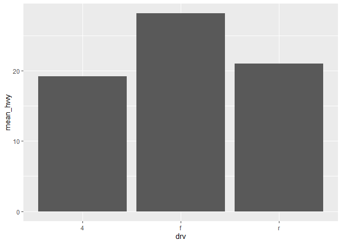

#ggplot2 강의 (데이터 시각화)
-데이터 불러오기 

```r
library(readxl)
library(ggplot2)
who_disease <- read_xlsx("r/who_disease.xlsx") 

#기본 시각화  
ggplot(who_disease, aes(x = year,
                        y = cases)) +
  #이제 그래프 종류 선택하자 
  geom_point()
```

<!-- -->

```r
?geom_point
```

```
## httpd 도움말 서버를 시작합니다 ... 완료
```

```r
  #옵션 1. 투명도 주기 : alpha
ggplot(who_disease, aes(x = year,
                        y = cases)) +
  geom_point(alpha = 0.5)
```

<!-- -->

```r
  #옵션 2. 색상변화 : color

ggplot(who_disease, aes(x = year,
                        y = cases)) +
  geom_point(alpha = 0.5, colour = "pink")
```

<!-- -->

```r
ggplot(who_disease, aes(x = year,
                        y = cases)) +
  geom_point(alpha = 0.5, 
             colour = "pink")
```

<!-- -->

- colour 입력 위치
  -geom_point(colour)
  -aes(x, y, colour + 컬럼명)
  

```r
  str(iris)
```

```
## 'data.frame':	150 obs. of  5 variables:
##  $ Sepal.Length: num  5.1 4.9 4.7 4.6 5 5.4 4.6 5 4.4 4.9 ...
##  $ Sepal.Width : num  3.5 3 3.2 3.1 3.6 3.9 3.4 3.4 2.9 3.1 ...
##  $ Petal.Length: num  1.4 1.4 1.3 1.5 1.4 1.7 1.4 1.5 1.4 1.5 ...
##  $ Petal.Width : num  0.2 0.2 0.2 0.2 0.2 0.4 0.3 0.2 0.2 0.1 ...
##  $ Species     : Factor w/ 3 levels "setosa","versicolor",..: 1 1 1 1 1 1 1 1 1 1 ...
```

```r
  ggplot(iris, aes(x = Sepal.Length, 
                   y = Sepal.Width, 
                   colour = Species)) + 
  geom_point()
```

<!-- -->

-산점도 : x축도 수치형 데이터(연속형), y축도 수치형 데이터(연속형)


```r
ggplot(who_disease, aes(x = year,
                        y = cases)) +
  geom_point()
```

<!-- -->
-히스토그램 
  질병 데이터 region = AMR , year = 1980, disease = 백잏래(pertussis)
  cases > 0 
  

```r
library(dplyr)
```

```
## 
## 다음의 패키지를 부착합니다: 'dplyr'
```

```
## The following objects are masked from 'package:stats':
## 
##     filter, lag
```

```
## The following objects are masked from 'package:base':
## 
##     intersect, setdiff, setequal, union
```

```r
str(who_disease)
```

```
## tibble [43,262 × 6] (S3: tbl_df/tbl/data.frame)
##  $ region     : chr [1:43262] "EMR" "EUR" "AFR" "EUR" ...
##  $ countryCode: chr [1:43262] "AFG" "ALB" "DZA" "AND" ...
##  $ country    : chr [1:43262] "Afghanistan" "Albania" "Algeria" "Andorra" ...
##  $ disease    : chr [1:43262] "measles" "measles" "measles" "measles" ...
##  $ year       : num [1:43262] 2016 2016 2016 2016 2016 ...
##  $ cases      : num [1:43262] 638 17 41 0 53 0 0 2 99 27 ...
```

```r
who_disease %>% 
  filter(region == 'AMR',
         year == 1980, 
         disease == 'pertussis', 
         cases > 0) -> data2
ggplot(data2, aes(x =cases)) + 
  geom_histogram(fill = "pink")
```

```
## `stat_bin()` using `bins = 30`. Pick better value with `binwidth`.
```

<!-- -->

```r
ggplot(data2,aes(x = country , y = cases)) +
  geom_col(fill= "grey") + 
  coord_flip() #자빠뜨리기 
```

<!-- -->

```r
library(ggplot2)
str(diamonds)
```

```
## tibble [53,940 × 10] (S3: tbl_df/tbl/data.frame)
##  $ carat  : num [1:53940] 0.23 0.21 0.23 0.29 0.31 0.24 0.24 0.26 0.22 0.23 ...
##  $ cut    : Ord.factor w/ 5 levels "Fair"<"Good"<..: 5 4 2 4 2 3 3 3 1 3 ...
##  $ color  : Ord.factor w/ 7 levels "D"<"E"<"F"<"G"<..: 2 2 2 6 7 7 6 5 2 5 ...
##  $ clarity: Ord.factor w/ 8 levels "I1"<"SI2"<"SI1"<..: 2 3 5 4 2 6 7 3 4 5 ...
##  $ depth  : num [1:53940] 61.5 59.8 56.9 62.4 63.3 62.8 62.3 61.9 65.1 59.4 ...
##  $ table  : num [1:53940] 55 61 65 58 58 57 57 55 61 61 ...
##  $ price  : int [1:53940] 326 326 327 334 335 336 336 337 337 338 ...
##  $ x      : num [1:53940] 3.95 3.89 4.05 4.2 4.34 3.94 3.95 4.07 3.87 4 ...
##  $ y      : num [1:53940] 3.98 3.84 4.07 4.23 4.35 3.96 3.98 4.11 3.78 4.05 ...
##  $ z      : num [1:53940] 2.43 2.31 2.31 2.63 2.75 2.48 2.47 2.53 2.49 2.39 ...
```

```r
ggplot(data = diamonds, aes( x = carat,
                             y = price ))  +
  geom_point()
```

<!-- -->


```r
ggplot(diamonds, aes(x = cut)) + 
  geom_bar(colour = "blue" , 
           fill = "pink" , 
            alpha = 0.5)
```

<!-- -->
#ggplot2 정교하게 그리기 

-막대그래프에 2개 범주 내용 반영하기 

```r
library(ggplot2)

ggplot(diamonds, aes(x = color, fill = cut)) +
  geom_bar(position = "dodge") #fill or dodge 선택
```

<!-- -->

#219p
선 그래프에 2개 범주 내용 반영 

```r
leisure <- read.csv("r/leisure.csv")
str(leisure)
```

```
## 'data.frame':	200 obs. of  3 variables:
##  $ age    : int  2 2 3 3 4 4 5 5 6 6 ...
##  $ sex    : chr  "female" "male" "female" "male" ...
##  $ expense: num  25.8 21 30 16.3 25.7 ...
```


```r
ggplot(data = leisure, aes( x = age,
                            y = expense,
                            col = sex)) +
  geom_line(size = 0.87,
            linetype = 1)
```

<!-- -->

#막대 그래프의 순서 변경 
-reorder() : 

```r
mpg1 <- read.csv("r/mpg1.csv", 
                 stringsAsFactors = F)
#데이터 가공 
drv_hwy <- mpg1 %>% 
  group_by(drv) %>%
  summarise(mean_hwy = mean(hwy))

drv_hwy
```

```
## # A tibble: 3 × 2
##   drv   mean_hwy
##   <chr>    <dbl>
## 1 4         19.2
## 2 f         28.2
## 3 r         21
```
`

```r
#기본그래프 
ggplot(data = drv_hwy, aes(x = drv, 
                           y = mean_hwy)) +
  geom_col() 
```

<!-- -->

```r
#오름차순 
ggplot(data = drv_hwy, aes(x = reorder(drv, mean_hwy),
                           y = mean_hwy)) +
  geom_col()
```

<!-- -->

```r
#내림차순 
ggplot(data = drv_hwy, aes(x = reorder(drv, -mean_hwy),
                           y = mean_hwy)) +
  geom_col() +
  labs(
    title = "제목",
    subtitle = "소제목",
    x = "엑슨데요",
    y = "와인데요",
    caption = "출처좀"
    
  )
```

<!-- -->
